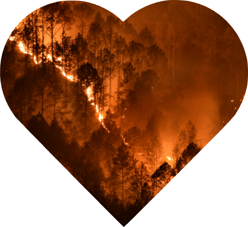

```{r, warning= FALSE, echo=FALSE, message=FALSE, include = FALSE}
library(tidyverse)
library(tmap)
library(ggplot2)
library(sf)
library(maps)
library(viridis)
library(dplyr)
library(htmltools)
library(glue)
library(leaflet)
library(tigris)
library(RColorBrewer)

us_county <- map_data("county") |>
  rename(state = region) |>
  rename(county = subregion) |>
  mutate(state = str_to_title(state),
        county = str_to_title(county))


fires <- read_csv("https://raw.githubusercontent.com/gwynniehayes/gwynnie-aria/refs/heads/main/Final%20Project/final_fires.csv") |>
  slice(-77)

states <- read_sf("https://rstudio.github.io/leaflet/json/us-states.geojson") |>
  filter(!(name %in% c("Alaska", "Hawaii", "Puerto Rico", "District of Columbia"))) |>
  select("name", "geometry") |>
  rename(state = name)

forests <- read.csv("https://raw.githubusercontent.com/gwynniehayes/SDS264/refs/heads/main/data/forests.csv") |>
  mutate('forest_cover' = forest_area/land_area * 100) 


county_data <- read_csv("https://raw.githubusercontent.com/gwynniehayes/gwynnie-aria/refs/heads/main/Final%20Project/COUNTYDATA.csv") |>
  janitor::clean_names() |>
  rename(state = state_name, county = name) |>
  select(c("county", "state", "population_2020", "sqmi"))

percent_forest <- read_csv("https://raw.githubusercontent.com/gwynniehayes/gwynnie-aria/refs/heads/main/Final%20Project/percentforestcover.csv") |>
  janitor::clean_names() 


percent_forest <- percent_forest |>
  mutate(county = str_remove(county, "\\d{5}\\s[A-Z][A-Z]\\s")) |> 
  mutate(county = fct_recode(county, "Okanogan" = "Okanagon",
                                     "De Baca" = "DeBaca",
                                     "Doña Ana" = "Dona Ana",
                                     "DeWitt" = "De Witt",
                                     "LaSalle" = "La Salle", 
                                     "LaPorte" = "La Porte",
                                     "LaGrange" = "Lagrange",
                                     "DeKalb" = "De Kalb",
                                     "Pleasants" = "Pleasant",
                                     "Dade" = "Miami-Dade"))

county_data <- county_data |>
  mutate(county = str_remove(county, "\\sCounty")) |> 
  mutate(county = fct_recode(county, "Okanogan" = "Okanagon",
                                     "De Baca" = "DeBaca",
                                     "Doña Ana" = "Do├▒a Ana",
                                     "DeWitt" = "De Witt",
                                     "LaSalle" = "La Salle", 
                                     "LaPorte" = "La Porte",
                                     "LaGrange" = "Lagrange",
                                     "DeKalb" = "De Kalb",
                                     "Pleasants" = "Pleasant",
                                     "Dade" = "Miami-Dade"))

percent_forest_ooga <- percent_forest |> 
  filter(state == "South Dakota", county == "Shannon") |>
  mutate(county = fct_recode(county, "Oglala Lakota" = "Shannon")) 

percent_forest <- percent_forest |> slice(-2384)


percent_forest <- percent_forest |> full_join(percent_forest_ooga)

forest_county_seperate <- percent_forest |>
  left_join(county_data) |>
  mutate(county_size_acres = sqmi * 640, forest_cover_acres = (percent_forest_cover / 100 * county_size_acres)) |> select(!sqmi) |> drop_na()


forest_county <- read.csv("https://raw.githubusercontent.com/gwynniehayes/gwynnie-aria/refs/heads/main/Final%20Project/forest_county.csv")

forest_county_oglala <- forest_county |> 
  filter(state == "South Dakota", county == "Shannon") |>
  mutate(county = fct_recode(county, "Oglala Lakota" = "Shannon")) 


forest_county <- forest_county |> 
  mutate(county = fct_recode(county, "Okanogan" = "Okanagon",
                                     "De Baca" = "DeBaca",
                                     "Doña Ana" = "Dona Ana",
                                     "DeWitt" = "De Witt",
                                     "LaSalle" = "La Salle", 
                                     "LaPorte" = "La Porte",
                                     "LaGrange" = "Lagrange",
                                     "DeKalb" = "De Kalb",
                                     "Pleasants" = "Pleasant")) |> slice(-2384)

forest_county <- forest_county |> full_join(forest_county_oglala)

counties_sf <- counties(cb = TRUE, resolution = "5m", year = 2021) |> 
  st_transform(crs = 4326) |>
  select("NAME", "STATE_NAME", "geometry") |>
  janitor::clean_names() |>
  rename(state = state_name) |>
  rename(county = name) |>
  mutate(county = fct_recode(county, "LaSalle" = "La Salle",
                                     "DeWitt" = "De Witt",
                                     "Dade" = "Miami-Dade"))


fullcounty <- counties_sf |> left_join(forest_county) |> drop_na(percent_forest_cover)

fires <- fires |> select(-9,-10,-11,-12) |> left_join(forest_county_seperate)


county_point <- read_csv("https://raw.githubusercontent.com/gwynniehayes/gwynnie-aria/refs/heads/main/Final%20Project/cfips_location.csv") |> rename(county = name)

pal <- colorNumeric("viridis", domain = c(0,100), reverse = T)
pal2 <- colorNumeric("magma", domain = c(0,270000), reverse = T)

fires25 <- fires |> filter(str_detect(containment_date, "2025"))
noend <- fires |> filter(str_detect(containment_date, "[^0,1,2,3,4,5,6,7,8,9]$"))

end24 <- fires |> anti_join(fires25) |> anti_join(noend) |>
  drop_na(containment_date) |>
  filter(containment_date != "unknown",
         containment_date != "2024") |>
  mutate(containment_date = fct_recode(containment_date, "November 4" = "{November 4"))

end25 <- fires25 |> 
  mutate(containment_date = fct_recode(containment_date, 
                                       "January 5, 2025" = "January 5 (2025)"),
        containment_date = as.factor(containment_date))

end24 <- end24 |>
  mutate(containment_date = glue_data(end24, "{containment_date}, 2024"),
         containment_date = as.factor(containment_date))

end24 <- end24 |> full_join(end25) |> select(-start_date)

start24 <- fires |>
  mutate(start_date = glue_data(fires, "{start_date}, 2024")) |> select(-containment_date)

dated_fires <- end24 |> left_join(start24) |> 
  relocate(containment_date, .after = start_date)

dated_fires <- dated_fires |>
  mutate(start_date = mdy(start_date),
         containment_date = mdy(containment_date),
         duration = containment_date - start_date,
         duration_cat = as.character(duration),
         duration_num = parse_number(duration_cat),
         duration_num = duration_num + 1,
         acres_per_day = acres/duration_num) 


trueburn <- dated_fires |> group_by(name) |> 
  reframe(n=n(),
            true_acres = acres/n,
          county = county) |> print(n=20)

state_size <- forest_county_seperate |> group_by(state) |>
  summarize(state_size = sum(county_size_acres),
            county = county,
            n()) |> drop_na()


dated_fires <- dated_fires |> left_join(trueburn) |> left_join(state_size)

dated_fires <- dated_fires |>
  mutate(percent_county_burned = true_acres/county_size_acres * 100,
         percent_forest_burned = true_acres/forest_cover_acres * 100,
         percent_state_burned = true_acres/state_size * 100)

county_point <- read_csv("https://raw.githubusercontent.com/StarryAri7/SDS264_F24/refs/heads/main/data/uscounties.csv") |> rename("state" = "state_name") |> select(county,state,lat,lng)

firesmall <-  makeIcon(
  iconUrl = "https://github.com/StarryAri7/SDS264_F24/blob/main/data/fire.png?raw=true",
  iconWidth = 28, iconHeight = 20)

firelarge <-  makeIcon(
  iconUrl = "https://github.com/StarryAri7/SDS264_F24/blob/main/data/fire.png?raw=true",
  iconWidth = 38, iconHeight = 28)
```

Ahhh Fire!!
=============

Column
----------

**Authors**

Gwynnie Hayes and Aria Whalen

**Introduction**

For our final project we found a data set of the wildfires in the United States in 2024. We scraped this table from this [Wikipedia page](https://en.wikipedia.org/wiki/Wildfires_in_the_United_States_during_2024). We were interested in exploring how much land area was burned in each of these counties. Since these were forest fires and Aria and I both like forest we also were interested in looking at the amount of forested land in each state and specifically in each county. To do this we found a data set from [ArcGIS](https://www.arcgis.com/home/item.html?id=14c5450526a8430298b2fa74da12c2f4#data) that had the county size for each US county from. Then we found a data set that had the percent forest coverage in each county from [US Fish and Wildlife](https://www.fws.gov/sites/default/files/documents/2024-08/percent-forest-cover-by-county-update-2024.xlsx). Based on the county size and the forested percent we then made a column with the amount of forested acres in each state. We also both really like maps, as our favorite data science processor said "I'm excited to see what you two spatial whizzes can do" and so we wanted to map a lot of maps, one might say to many maps. But we say not enough maps!

**Some Cleaning**

In the fires data set there were a couple fires that crossed state lines and many that crossed county lines, one of the main cleaning things we did were was separate these into individual rows, an issue that led to was one of the largest fires was in texas the smokehouse road fire, it burned over a million acres. After separating this into one county per row there were now seemingly 7 million more acres of fire then in reality. To fix this we divided each of the acres of fire by the amount of counties it covered. 

**Data!**

-   [Wildfires](https://en.wikipedia.org/wiki/Wildfires_in_the_United_States_during_2024)

-   [County Sizes](https://www.arcgis.com/home/item.html?id=14c5450526a8430298b2fa74da12c2f4#data)

-   [Forested Areas](https://www.fws.gov/sites/default/files/documents/2024-08/percent-forest-cover-by-county-update-2024.xlsx)

-   [County points](https://simplemaps.com/data/us-counties)

-   [Fire Icon](https://www.streamlinehq.com/emojis/download/fire--31878)

-   [Fire Picture](https://suramericana.com/en/blog/habitat-2/qual-e-o-impacto-dos-incendios-florestais-no-ecossistema/)

Column 
------------




Do you like County Graphs??
======================


Inputs {.sidebar}
-------------------------

Summary Statistics my beloved!


```{r, warning= FALSE, echo=FALSE, message=FALSE}
inputPanel(
  selectInput("state4", label = "Select a State",
              choices = c(states$state),
              selected = "Washington"),
  
  selectInput("var", label = "Select a Bar Graph Variable",
              choices = c("% Forest Coverage" = "percent_forest_cover", 
                          "County Size" = "county_size_acres",
                          "Acres Burned" = "acres", 
                          "Percent County Burned" = "percent_county_burned")),
  
   selectInput("var2", label = "Select a Boxplot Variable",
              choices = c("Duration of Fire" = "duration_divided",
                          "Rate of Burn" = "acres_per_day"))
)


```


Column
--------

```{r, warning= FALSE, echo=FALSE, message=FALSE}
renderPlot({
  dated_fires |>
    filter(state == input$state4) |>
    mutate(county = fct_reorder(county, .data[[input$var]], .fun = sum, .desc = T)) |>
    ggplot(aes(y = .data[[input$var]], x = county, fill = county)) +
    geom_col(show.legend = FALSE) + 
    theme(axis.text.x = element_text(angle = 45, vjust = 0.75))
})
```

```{r, warning= FALSE, echo=FALSE, message=FALSE}
renderPlot({

    dated_fires |>
    filter(state == input$state4) |>
    mutate(county = fct_reorder(county, .data[[input$var]], .fun = sum, .desc = T)) |>
    ggplot(aes(y = .data[[input$var2]], x = county, fill = county)) +
    geom_boxplot(show.legend = FALSE) + 
    theme(axis.text.x = element_text(angle = 45, vjust = 0.75))
  


})
```


Column
--------

```{r, warning= FALSE, echo=FALSE, message=FALSE}
renderPlot({

  p1 <-  dated_fires |>
    mutate(state = fct_reorder(state, .data[[input$var]], .fun = sum, .desc = T)) |>
    ggplot(aes(y = .data[[input$var]], x = state, fill = state)) +
    geom_col(show.legend = FALSE) + 
    theme(axis.text.x = element_text(angle = 45, vjust = 0.75))

p2 <- dated_fires |>
    mutate(state = fct_reorder(state, percent_state_burned, .fun = sum, .desc = T)) |>
    ggplot(aes(y = percent_state_burned, x = state, fill = state)) +
    geom_col(show.legend = FALSE) + 
    theme(axis.text.x = element_text(angle = 45, vjust = 0.75))

ifelse(input$var == "percent_county_burned", print(p2), print(p1))

})
```

```{r, warning= FALSE, echo=FALSE, message=FALSE}
renderPlot({

  
dated_fires |>
    mutate(state = fct_reorder(state, .data[[input$var]], .fun = sum, .desc = T)) |>
    ggplot(aes(y = .data[[input$var2]], x = state, fill = state)) +
    geom_boxplot(show.legend = FALSE) + 
    theme(axis.text.x = element_text(angle = 45, vjust = 0.75))


})
```

What about fire??
======================

Inputs {.sidebar}
-------------------------
```{r, warning= FALSE, echo=FALSE, message=FALSE}
inputPanel(
  selectInput("state4", label = "Select a State",
              choices = c(states$state),
              selected = "Washington"),
  
  selectInput("var3", label = "Select a Bar Graph Variable",
              choices = c("Acres Burned" = "acres", 
                          "Percent County Burned" = "percent_county_burned",
                          "Duration of Fire" = "duration_divided",
                          "Rate of Burn" = "acres_per_day")),

)
```


Column
--------

```{r, warning= FALSE, echo=FALSE, message=FALSE}
renderPlot({
  dated_fires |>
    filter(state == input$state4) |>
    mutate(county = fct_reorder(name, .data[[input$var3]], .fun = sum, .desc = T)) |>
    ggplot(aes(y = .data[[input$var3]], x = name, fill = name)) +
    geom_col(show.legend = FALSE) + 
    theme(axis.text.x = element_text(angle = 45, vjust = 0.75))
})
```


Of Forests and Fire
=======================

Inputs {.sidebar}
-------------------------

Were you ever curious how many acres of forested land were in you state for each county? Maybe you're on the hunt for where local fires have taken place? Well today's your lucky day with this interactive map you can find out how much of your county is forested and which parts caught on fire in 2024!

```{r, warning= FALSE, echo=FALSE, message=FALSE}
inputPanel(
  selectInput("state", label = "Select a State",
              choices = c(states$state),
              selected = "Washington"))
```

Column 
--------------------

```{r, warning= FALSE, echo=FALSE, message=FALSE}

renderLeaflet({
  # counties_sf |> left_join(forest_county) |> drop_na(percent_forest_cover) |>
  #   filter(state == input$state) |> 
  #   ggplot() + geom_sf(aes(fill = percent_forest_cover)) +
  #   scale_fill_viridis(option = "viridis", direction = -1) +
  #   theme_linedraw()

fullcounty |> filter(state == input$state) |> leaflet() |> 
  addPolygons(fillColor = ~pal(percent_forest_cover),
              weight = 1,
              opacity = 1,
              # I really like the white dash outline
              color = "black",
              dashArray = "5",
              # I wanted a little opacity so you can see the state names!
              fillOpacity = 1,
              
              highlightOptions = highlightOptions(
                weight = 5,
                color = "#666",
                dashArray = "",
                fillOpacity = 0.7,
                bringToFront = TRUE),
              # Again I wanted to set custom clean labels, so I used this format
              label = ~paste(county, "County has", percent_forest_cover, "% forest coverage"),
    labelOptions = labelOptions(
      style = list("font-weight" = "normal", padding = "3px 15px"),
      textsize = "15px",
      direction = "auto"))
  
  
})
```


```{r}
renderLeaflet({
  
  
counties_sf |> full_join(dated_fires) |>
  filter(state != "Alaska", state != "Hawaii", 
         state != "Commonwealth of the Northern Mariana Islands",
         state != "Puerto Rico",
         state != "United States Virgin Islands",
         state != "American Samoa",
         state != "Guam") |>
   filter(state == input$state) |>
    leaflet() |> 
  addPolygons(fillColor = ~pal2(true_acres),
              weight = 1,
              opacity = 1,
              # I really like the white dash outline
              color = "black",
              dashArray = "5",
              # I wanted a little opacity so you can see the state names!
              fillOpacity = 1,
              
              highlightOptions = highlightOptions(
                weight = 5,
                color = "#666",
                dashArray = "",
                fillOpacity = 0.7,
                bringToFront = TRUE),
              # Again I wanted to set custom clean labels, so I used this format
              label = ~paste(county, "County has", true_acres, "Acres Burnt"),
    labelOptions = labelOptions(
      style = list("font-weight" = "normal", padding = "3px 15px"),
      textsize = "15px",
      direction = "auto"))
  
})
```


Column 
---------
```{r, warning= FALSE, echo=FALSE, message=FALSE}


renderPlot({
counties_sf |> left_join(forest_county) |> drop_na(percent_forest_cover) |>
    ggplot() + geom_sf(aes(fill = percent_forest_cover)) +
    scale_fill_viridis(option = "viridis", direction = -1) +
    theme_linedraw() +
    labs(fill = "% Forest Coverage", title = "Percentage of Forest Coverage in each US County", x = "Longitude", y = "Latitude", caption = "Data Source: USDA Forest Service FIA Annual Report")
})
```    

```{r, warning= FALSE, echo=FALSE, message=FALSE}

renderPlot({
counties_sf |> full_join(dated_fires) |>
  filter(state != "Alaska", state != "Hawaii", 
         state != "Commonwealth of the Northern Mariana Islands",
         state != "Puerto Rico",
         state != "United States Virgin Islands",
         state != "American Samoa",
         state != "Guam"
         ) |>
    ggplot() + geom_sf(aes(fill = true_acres)) +
    scale_fill_viridis(option = "magma", direction = -1) +
  theme_linedraw() +
  labs(fill = "Acres Burned", title = "Acres Burned in each US County", x = "Longitude", y = "Latitude", caption = "Data Source: USDA Forest Service FIA Annual Report")
    
  # ggplot(mapping = aes(x = long, y = lat, group = group)) + 
  # geom_polygon(aes(fill = percent_forest_cover), color = "black", linewidth = 0.2) + 
  # labs(fill = "% Forest Coverage", title = "Percent of Forest Coverage in each US State", x = "Longitude", y = "Latitude", caption = "Data Source: USDA Forest Service FIA Annual Report") +
  # coord_map() +
  # scale_fill_viridis(option = "viridis", direction = -1) +
  # theme_linedraw()
})
```


Fire!
===============
```{r, warning= FALSE, echo=FALSE, message=FALSE}
inputPanel(
  selectInput("state2", label = "Select a State",
              choices = c("None", fires$state)))
```

Column 
-------------
```{r, warning= FALSE, echo=FALSE, message=FALSE}
renderPlot({
  fires |> full_join(us_county) |>
    filter(state == input$state2) |>
    ggplot(mapping = aes(x = long, y = lat, group = group)) + 
      geom_polygon(aes(fill = acres), color = "black") +
      coord_map() +
    scale_fill_viridis(option = "magma", direction = -1) +
    theme_linedraw()
})
```

Column 
------------
```{r, warning= FALSE, echo=FALSE, message=FALSE}
renderPlot({
fires |> full_join(us_county) |>
  ggplot(mapping = aes(x = long, y = lat, group = group)) + 
  geom_polygon(aes(fill = acres), color = "black", linewidth = 0.2) + 
  labs(fill = "Acres Burned", title = "Acres Burned in each US County", x = "Longitude", y = "Latitude", caption = "Data Source: USDA Forest Service FIA Annual Report") +
  coord_map() +
  scale_fill_viridis(option = "magma", direction = -1) +
  theme_linedraw()
})
```

Interactive Fire!!! 
==========

```{r, warning= FALSE, echo=FALSE, message=FALSE}
inputPanel(
  selectInput("state3", label = "Select a State",
              choices = fires$state), value = "Minnesota")
```
Woah More Fire?
=========

Inputs {.sidebar}
-------------

Ok so we already talked about fire, but were you ever curious to learn more about it? Well nows your chance, with this interactive map you can see how many acres were burned, how long the fire was, how much of the county was burned and the rate at which the fires burned.

```{r}
inputPanel(
  selectInput("var2", label = "Select a Mapping Variable",
              choices = c("Acres Burned" = "acres", 
                          "Percent County Burned" = "percent_county_burned",
                          "Duration of Fire" = "duration_num",
                          "Rate of Burn" = "acres_per_day")))

var_labels <- c(
  acres = "Acres Burned",
  percent_county_burned = "Percent County Burned",
  duration_num = "Duration of Fire",
  acres_per_day = "Rate of Burn"
)
colors <- c(
  acres = "#F2572C",
  percent_county_burned = "#f3e422",
  duration_num = "#F09222",
  acres_per_day = "#A12344")
```

Column
---------------

```{r}
renderLeaflet({

  county_point$Latitude <- jitter(county_point$lat, factor = 0.1)
  county_point$Longitude <- jitter(county_point$lng, factor = 0.1)
  
  county_sf <- st_as_sf(county_point, coords = c("Longitude", "Latitude"), crs = 4326)

  test <- county_sf |> left_join(dated_fires) |> drop_na(acres) |> 
    st_jitter(factor = 0.005)

  selected <- test[[input$var2]]
  label <- var_labels[[input$var2]]
  colors <- colors[[input$var2]]
  
  leaflet(test) |>
    addProviderTiles("Stadia.StamenTerrain") |>
    addCircleMarkers(
      radius = ~ selected / max(selected) * 10,
      fillOpacity = 0.5,
      col = ~colors, 
      popup = ~paste("<strong>Name: </strong>", name, " Fire<br>",
                     "<strong>Area Burned: </strong>", acres, " Acres<br>",
                     "<strong>County: </strong>", county, " County<br>",
                     "<strong>", label, ": </strong>", selected))
  })
```

Look if you dare!
==========

```{r}
ui <- fluidPage(
  inputPanel(
    actionButton("start", "DON'T CLICK HERE!!!")
  ),
  leafletOutput("firemap", height = "600px")
)

server <- function(input, output, session) {
  county_point$Latitude <- jitter(county_point$lat, factor = 0.1)
  county_point$Longitude <- jitter(county_point$lng, factor = 0.1)

  county_sf <- st_as_sf(county_point, coords = c("Longitude", "Latitude"), crs = 4326)

  test <- county_sf |> 
    left_join(fires) |> 
    drop_na(acres) |> 
    st_jitter(factor = 0.005)

  firesmall <-  makeIcon(
    iconUrl = "https://github.com/StarryAri7/SDS264_F24/blob/main/data/fire.png?raw=true",
    iconWidth = 28, iconHeight = 20)

  start_triggered <- reactiveVal(FALSE)
  current_index <- reactiveVal(0)

  output$firemap <- renderLeaflet({
    leaflet(test) |>
      addProviderTiles("Stadia.StamenTerrain") |>
      setView(lng = -98.5795, lat = 39.8283, zoom = 4)
  })

  observeEvent(input$start, {
    if (!start_triggered()) {
      start_triggered(TRUE)
      current_index(1)
    }
  })

  observe({
    req(start_triggered())

    invalidateLater(100, session)

    i <- current_index()
    if (i <= nrow(test)) {
      leafletProxy("firemap") |>
        addMarkers(
          data = slice(test, i),
          icon = firesmall,
          popup = ~paste(
            "<strong> Name: </strong>", name, "Fire <br>",
            "<strong> Area Burned: </strong>", acres, "Acres <br>",
            "<strong> County: </strong>", county, "County <br>"
          )
        )
      current_index(i + 1)
    }
  })
}

shinyApp(ui, server)

```

